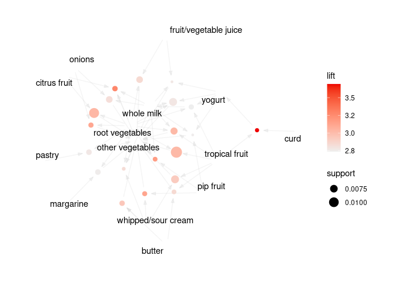

arulesViz - Visualizing Association Rules and Frequent Itemsets with R
================

[](https://CRAN.R-project.org/package=arulesViz)
[](https://mhahsler.r-universe.dev/ui#package:arulesViz)
[](https://CRAN.R-project.org/package=arulesViz)

This R package extends package
[arules](https://github.com/mhahsler/arules) with various visualization
techniques for association rules and itemsets. The package also includes
several interactive visualizations for rule exploration.

## Installation

**Stable CRAN version:** install from within R with

``` r
install.packages("arulesViz")
```

**Current development version:** Install from
[r-universe.](https://mhahsler.r-universe.dev/ui#package:arulesViz)

This might also require the development version of
[arules](https://github.com/mhahsler/arules).

## Features

-   Visualizations using engines `ggplot2` (default engine for most
    methods), `grid`, `base` (R base plots), `htmlwidget` (powered by
    `plotly` and `visNetwork`).
-   Interactive visualizations using `grid`, `plotly` and `visNetwork`.
-   Interactive rule inspection with `datatable`.
-   Integrated interactive rule exploration using `ruleExplorer`.

### Available Visualizations:

-   Scatterplot, two-key plot
-   Matrix and matrix 3D visualization
-   Grouped matrix-based visualization
-   Several graph-based visualizations
-   Doubledecker and mosaic plots
-   Parallel Coordinate plot

## Usage

Mine some rules.

``` r
library("arulesViz")
data("Groceries")
rules <- apriori(Groceries, parameter = list(support = 0.005, confidence = 0.5))
```

    ## Apriori
    ## 
    ## Parameter specification:
    ##  confidence minval smax arem  aval originalSupport maxtime support minlen
    ##         0.5    0.1    1 none FALSE            TRUE       5   0.005      1
    ##  maxlen target  ext
    ##      10  rules TRUE
    ## 
    ## Algorithmic control:
    ##  filter tree heap memopt load sort verbose
    ##     0.1 TRUE TRUE  FALSE TRUE    2    TRUE
    ## 
    ## Absolute minimum support count: 49 
    ## 
    ## set item appearances ...[0 item(s)] done [0.00s].
    ## set transactions ...[169 item(s), 9835 transaction(s)] done [0.00s].
    ## sorting and recoding items ... [120 item(s)] done [0.00s].
    ## creating transaction tree ... done [0.00s].
    ## checking subsets of size 1 2 3 4 done [0.00s].
    ## writing ... [120 rule(s)] done [0.00s].
    ## creating S4 object  ... done [0.00s].

### Standard visualizations

``` r
plot(rules)
```

<!-- -->

``` r
plot(rules, method = "graph", limit = 20)
```

<!-- -->

### Interactive visualization

Live examples for interactive visualizations can be seen in [Chapter 5
of An R Companion for Introduction to Data
Mining](https://mhahsler.github.io/Introduction_to_Data_Mining_R_Examples/book/association-analysis-basic-concepts-and-algorithms.html#interactive-visualizations)

## References

-   Michael Hahsler. [arulesViz: Interactive visualization of
    association rules with
    R.](https://journal.r-project.org/archive/2017/RJ-2017-047/RJ-2017-047.pdf)
    *R Journal,* 9(2):163-175, December 2017.
-   Michael Hahsler. [An R Companion for Introduction to Data Mining:
    Chapter
    5](https://mhahsler.github.io/Introduction_to_Data_Mining_R_Examples/book/association-analysis-basic-concepts-and-algorithms.html).
    Online Book.
    <https://mhahsler.github.io/Introduction_to_Data_Mining_R_Examples/book/>,
    2021.
-   Michael Hahsler, Sudheer Chelluboina, Kurt Hornik, and Christian
    Buchta. [The arules R-package ecosystem: Analyzing interesting
    patterns from large transaction
    datasets.](https://jmlr.csail.mit.edu/papers/v12/hahsler11a.html)
    *Journal of Machine Learning Research,* 12:1977-1981, 2011.
-   Michael Hahsler and Sudheer Chelluboina. [Visualizing Association
    Rules: Introduction to the R-extension Package
    arulesViz](https://cran.r-project.org/package=arulesViz/vignettes/arulesViz.pdf)
    (with complete examples).
