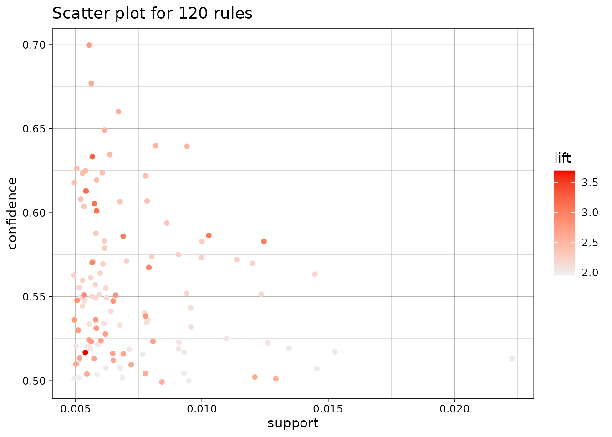
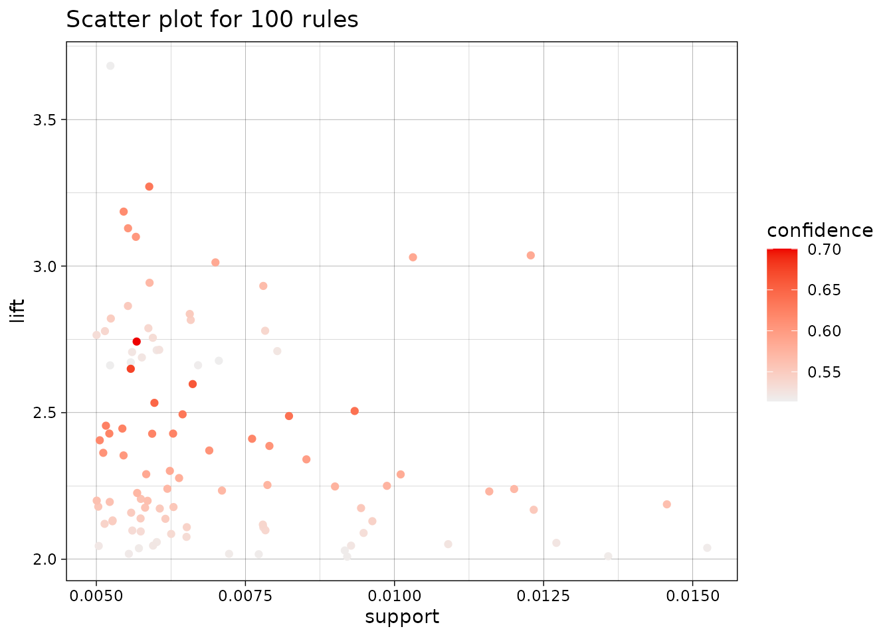
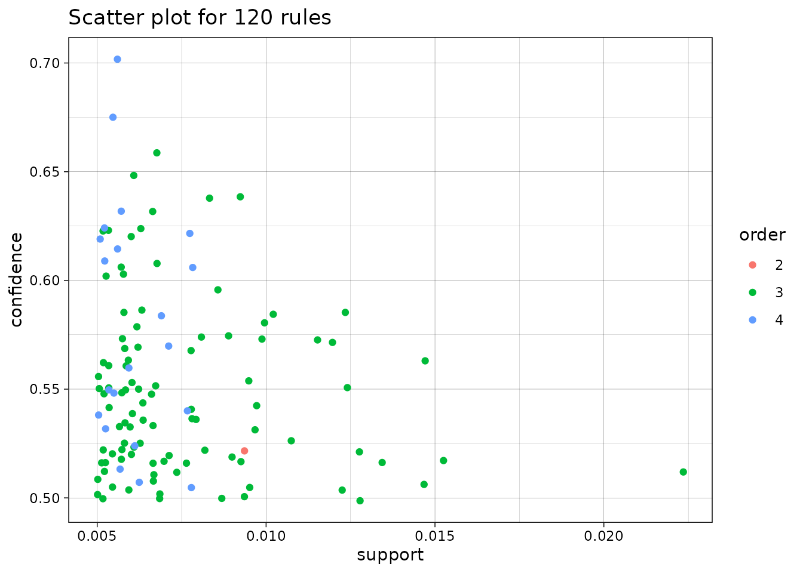
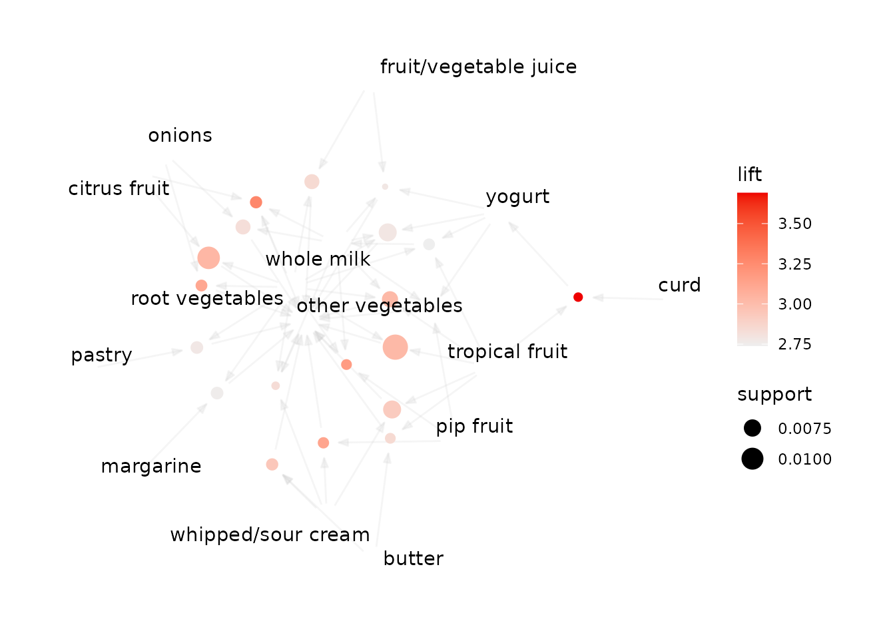
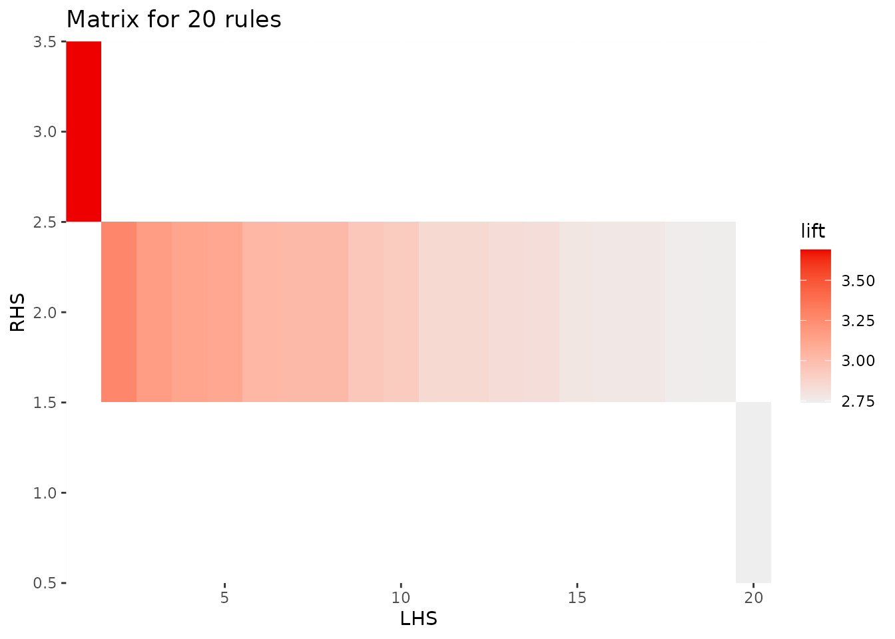
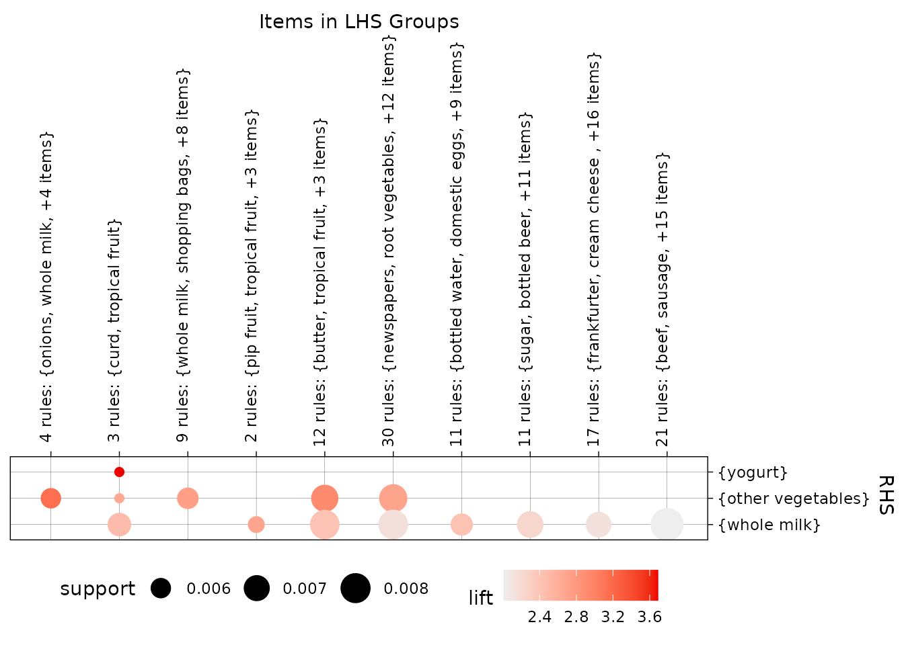
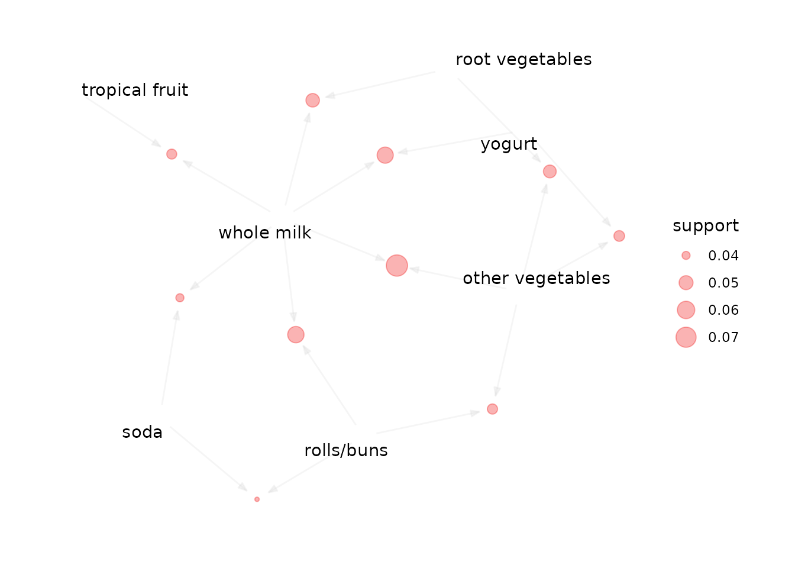

# Getting Started with arulesViz

`arulesViz` adds static and interactive visualizations for association
rules and frequent itemsets created with
[`arules`](https://CRAN.R-project.org/package=arules). This vignette
shows a typical first workflow: mine a set of rules, look at its overall
structure, select an interesting subset, and inspect that subset in more
detail.

## Installation

Install the released version from CRAN and load it:

``` r

install.packages("arulesViz")
library(arulesViz)
```

Loading `arulesViz` also loads `arules`, which provides the data
structures and mining algorithms used below.

## Create a set of rules

We use the `Groceries` transaction data included with `arules` and mine
rules with the Apriori algorithm. The thresholds are deliberately
restrictive so the resulting rule set is small enough to explore
comfortably.

``` r

data("Groceries")

rules <- apriori(
  Groceries,
  parameter = list(support = 0.005, confidence = 0.5),
  control = list(verbose = FALSE)
)
rules
#> set of 120 rules
```

`arulesViz` extends the standard
[`plot()`](http://michael.hahsler.net/arulesViz/reference/plot_arulesViz.md)
generic for objects of class `rules` and `itemsets`. For rules, the
default is a scatter plot of support against confidence, with color
representing lift.

## Start with an overview

``` r

plot(rules)
#> To reduce overplotting, jitter is added! Use jitter = 0 to prevent jitter.
```



Each point is one rule. Rules toward the upper right have higher support
and confidence, while the color scale identifies rules with high lift.
Measures can be changed explicitly, and `limit` keeps the most highly
shaded rules when a rule set is too large to display clearly.

``` r

plot(
  rules,
  measure = c("support", "lift"),
  shading = "confidence",
  limit = 100
)
#> To reduce overplotting, jitter is added! Use jitter = 0 to prevent jitter.
```



A two-key plot uses color for the rule length (also called its order).

``` r

plot(rules, method = "two-key plot")
#> To reduce overplotting, jitter is added! Use jitter = 0 to prevent jitter.
```



## Focus on interesting rules

Most detailed visualizations work best on a selected subset. Here we
sort by lift and retain 20 rules. In a real analysis, selection should
also reflect the application, for example by requiring a particular item
on the left- or right-hand side.

``` r

rules_top <- head(sort(rules, by = "lift"), 20)
inspect(head(rules_top, 5))
#>     lhs                     rhs                    support confidence    coverage     lift count
#> [1] {tropical fruit,                                                                            
#>      curd}               => {yogurt}           0.005287239  0.5148515 0.010269446 3.690645    52
#> [2] {citrus fruit,                                                                              
#>      root vegetables,                                                                           
#>      whole milk}         => {other vegetables} 0.005795628  0.6333333 0.009150991 3.273165    57
#> [3] {pip fruit,                                                                                 
#>      root vegetables,                                                                           
#>      whole milk}         => {other vegetables} 0.005490595  0.6136364 0.008947636 3.171368    54
#> [4] {pip fruit,                                                                                 
#>      whipped/sour cream} => {other vegetables} 0.005592272  0.6043956 0.009252669 3.123610    55
#> [5] {root vegetables,                                                                           
#>      onions}             => {other vegetables} 0.005693950  0.6021505 0.009456024 3.112008    56
```

A graph makes the items shared by rules easy to see. Rule vertices
connect left-hand-side items to right-hand-side items.

``` r

plot(rules_top, method = "graph")
```



A matrix plot places antecedents in columns and consequents in rows.
Color represents the selected interest measure; the default shading
measure is lift.

``` r

plot(rules_top, method = "matrix")
#> Itemsets in Antecedent (LHS)
#>  [1] "{tropical fruit,curd}"                          
#>  [2] "{citrus fruit,root vegetables,whole milk}"      
#>  [3] "{pip fruit,root vegetables,whole milk}"         
#>  [4] "{pip fruit,whipped/sour cream}"                 
#>  [5] "{root vegetables,onions}"                       
#>  [6] "{citrus fruit,root vegetables}"                 
#>  [7] "{tropical fruit,root vegetables,whole milk}"    
#>  [8] "{tropical fruit,root vegetables}"               
#>  [9] "{butter,whipped/sour cream}"                    
#> [10] "{tropical fruit,whipped/sour cream}"            
#> [11] "{tropical fruit,butter}"                        
#> [12] "{root vegetables,fruit/vegetable juice}"        
#> [13] "{root vegetables,whole milk,whipped/sour cream}"
#> [14] "{onions,whole milk}"                            
#> [15] "{root vegetables,whole milk,yogurt}"            
#> [16] "{whole milk,yogurt,fruit/vegetable juice}"      
#> [17] "{root vegetables,pastry}"                       
#> [18] "{root vegetables,margarine}"                    
#> [19] "{pip fruit,whole milk,yogurt}"                  
#> [20] "{tropical fruit,root vegetables,yogurt}"        
#> Itemsets in Consequent (RHS)
#> [1] "{whole milk}"       "{other vegetables}" "{yogurt}"
```



For larger rule sets, the grouped matrix view clusters similar
antecedents. The `k` argument controls the number of groups.

``` r

plot(rules, method = "grouped matrix", k = 10)
```



Other available methods include parallel coordinates (`"paracoord"`)
and, for a single rule together with its original transactions, mosaic
and double decker plots. Use the built-in help interface to discover the
methods, rendering engines, and method-specific controls:

``` r

plot(rules, method = "help")
plot(rules, method = "graph", engine = "help")
plot(rules, method = "graph", control = "help")
```

## Interactive exploration

Several visualization methods can produce HTML widgets. Hovering over
points in this scatter plot reveals the corresponding rule and its
quality measures.

``` r

plot(rules, engine = "htmlwidget")
```

[`inspectDT()`](http://michael.hahsler.net/arulesViz/reference/inspectDT.md)
creates a searchable and sortable table, while
[`ruleExplorer()`](http://michael.hahsler.net/arulesViz/reference/ruleExplorer.md)
starts a Shiny application that combines filtering, tables, and plots.

``` r

inspectDT(rules)
ruleExplorer(rules)
```

HTML widgets can become slow with very large rule sets. Select rules
first or use `limit` before creating an interactive visualization.

## Visualize frequent itemsets

The same interface also supports frequent itemsets. For example, mine
itemsets with [`eclat()`](https://rdrr.io/pkg/arules/man/eclat.html) and
display the ten most frequent itemsets as a graph:

``` r

itemsets <- eclat(
  Groceries,
  parameter = list(support = 0.02, minlen = 2),
  control = list(verbose = FALSE)
)

plot(itemsets, method = "graph", limit = 10)
```



For a complete description of all visualization methods and their
arguments, see
[`?arulesViz::plot`](http://michael.hahsler.net/arulesViz/reference/plot_arulesViz.md).
The package documentation for
[`inspectDT()`](http://michael.hahsler.net/arulesViz/reference/inspectDT.md)
and
[`ruleExplorer()`](http://michael.hahsler.net/arulesViz/reference/ruleExplorer.md)
covers the interactive tools in more detail.
